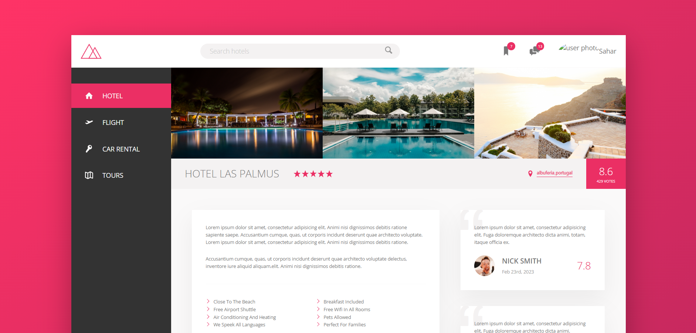

# 🏨 Trillo — Your All-in-One Booking App

**Trillo** is a modern, responsive hotel booking landing page built with **HTML**, **SCSS**, and **JavaScript**. This frontend-only project is a showcase of advanced layout techniques using **Flexbox**, **CSS Grid**, and a modular **SCSS architecture**.

---

## 🚀 Features

- Responsive hotel search interface
- Navigation bar with interactive icons
- Image gallery with grid layout
- Hotel description with amenities
- Customer reviews section
- Booking call-to-action (CTA)

---

## 📸 Preview



---

## 🛠 Technologies Used

- HTML5
- SCSS (compiled with Dart Sass)
- PostCSS + Autoprefixer
- npm-run-all (task automation)
- Live Server (for development)

---

## 📦 Getting Started

### 1. Clone the repository

```bash
git clone https://github.com/your-username/trillo.git
cd trillo
```

2. **Install dependencies**

   ```bash
   npm install
   ```

3. **Start development server**

   ```bash
   npm start
   ```

   This will:

   - Compile SCSS to CSS in watch mode
   - Launch Live Server for hot-reloading

## 🛠 Available Scripts

| Script         | Description                                       |
| -------------- | ------------------------------------------------- |
| `npm start`    | Runs `devserver` and `watch:sass` in parallel     |
| `watch:sass`   | Watches SCSS files and compiles them to CSS       |
| `compile:sass` | Compiles `sass/main.scss` to `css/style.comp.css` |
| `prefix:css`   | Adds vendor prefixes using PostCSS                |
| `compress:css` | Compresses final CSS                              |
| `build:css`    | Runs all steps to generate final CSS              |

## 📁 Folder Structure

```
trillo/
│
├── css/
│   └── style.css          # Compiled CSS
│
├── sass/
│   └── main.scss          # Main SCSS file (modularized)
│
├── img/
│   └── ...                # Images and sprite.svg
│
├── index.html
├── package.json
└── README.md
```

### 📌 Live Demo

## Demo

You can view the live demo of the project here:  
[Trillo - Netlify](https://aurora-trillo.netlify.app/)

## 📸 Credits

- Icons from [iconmonstr.com](https://iconmonstr.com)
- Fonts from [Google Fonts](https://fonts.google.com/)
- Design inspired by Jonas Schmedtmann’s Advanced CSS course

## 📄 License

This project is licensed under the [MIT License](LICENSE).

---

> Designed and built by **Sahar** ✨
